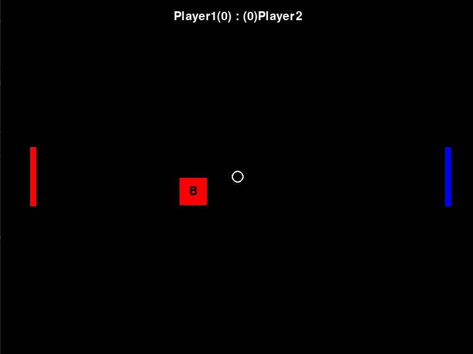
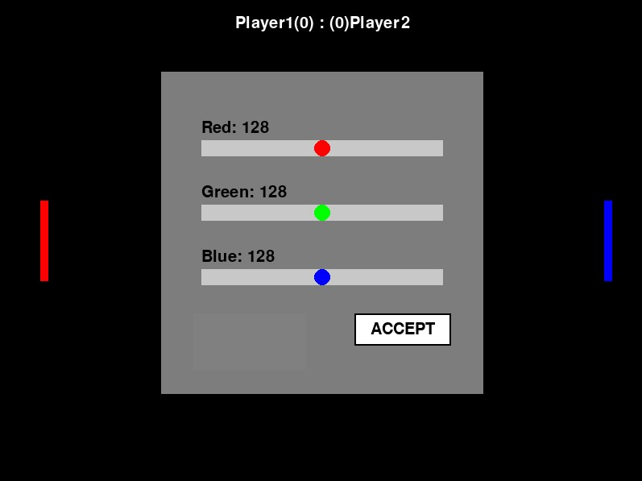

# Pong Multiplayer Game

A network-based version of the classic **Pong** game where two players can compete against each other over a local network or the internet.

## Features

* real-time multiplayer,
* bonus boxes that affect the ball speed,
* customizable paddle colors,
* built-in chat,
* pause and resume functionality.

## Installation

Clone the repository:

```bash
git clone https://gitlab.fit.cvut.cz/BI-PYT/b241/buranilj.git
cd buranilj
```

Create and activate a virtual environment:

```bash
python3 -m venv venv
source venv/bin/activate
```

Install the required dependencies:

```bash
pip install -r requirements.txt
```

## Running the Game

### Server

Start the server with:

```bash
python src/server/main.py
```

The server will start listening on the default port `12345`.

### Client

Start the client with:

```bash
python src/client/main.py
```

After launching the client, enter:

1. the server IP address,
2. your nickname.

## Controls

### Paddle Movement

| Key | Action               |
| --- | -------------------- |
| `↑` | Move the paddle up   |
| `↓` | Move the paddle down |

### Chat

Press `T` to enter chat mode.

* Press `Enter` to send a message.
* Use `Backspace` to edit your message.

### Color Selection

1. Open the chat by pressing `T`.
2. Enter the `/color` command.
3. Use the RGB sliders to select your paddle color.
4. Click **ACCEPT** to apply the new color.

### Bonus Boxes

When a bonus box appears on the screen, click it before your opponent does. The next hit will make the ball move faster.

### Game Controls

| Command     | Action                   |
| ----------- | ------------------------ |
| `/continue` | Start or resume the game |
| `/pause`    | Pause the game           |

## Screenshots

### Gameplay



### Game Interface

